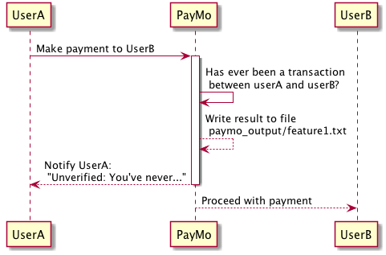
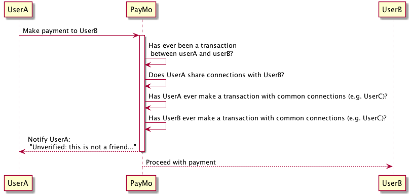
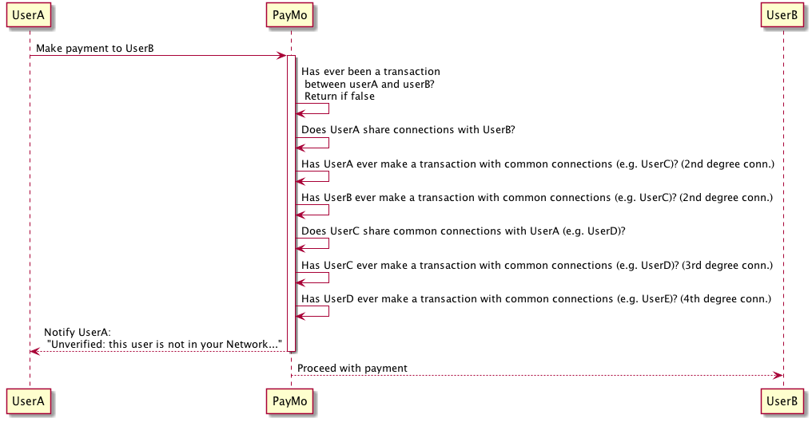

# Table of Contents

0. [How to use this code](README.md#how-to-use)
1. [Details of implementation so far](README.md#details-of-my-own-implementation)
2. [My notes about requirements](README.md#understanding-requirements)
3. [Personal notes](README.md#personal-notes)

## How to use

@todo create a docker container to provide python 3.5 , pip, pandas.

From root folder run as: $ ./run.sh ./paymo_input/batch_payment.csv ./paymo_input/stream_payment.csv ./paymo_output/output1.txt ./paymo_output/output2.txt ./paymo_output/output3.txt

Or from ./insight_testsuite execute ./run_test.sh

#### Requirements

```
------------------
python: 3.5.1.final.0

```

#### Log

@see ./results.txt file for events while analyzing payments and/or preparing batch data.

##Details of my own implementation

#### Clean (sanitize) batch data 

* run.sh will take care of cleaning the first batch of data (batch_payment.csv). I only need id1 and id2 so far.

#### Goal in my code

On early commits and the master branch of this program I was using an incorrect approach to solve the problem. It was also very very slow. I ended up refreshing my knowledge on lists, stacks, queues, trees and graphs. So far, only feature 1 is solved.

A graph (which it was very obvious I had to use in the first place :/) will let me search for relationships at the nth-degree 
with the best performance. 

The best case scenario is the use of graphs and an algorithm like: [Dijstra](https://en.wikipedia.org/wiki/Dijkstra%27s_algorithm). One of my thoughts was to 
use a python library [Network](https://networkx.github.io/index.html). But, instead I started implementing my graph and applying graphs since it's what it's going be evaluated the most. 

@todo add more test cases.

## Understanding requirements
My Notes about requirements:

* Datasets: The Dataset is 'real'-Venmo. If the dataset has interesting data use it for new features. batch_payment.csv (old transactions) - use to build the initial state of the user network. stream_payment.csv (stream transactions?) - use it to detect fraud or warn user. 
** id1: ID of user making the payment
** id2: ID of user receiving the payment

* Verify stream_payment.csv and batch_payment.csv have content. Using: $ cat file | more. Yes it has emojis, lol.

* Input: No need to connect to an API. Datasets are inside paymo_input directory.

* Output: Process each line from stream_payment.csv and for each payment output a line containing TRUSTED or UNVERIFIED.

* Assume that stream_payment.csv corresponds to new payments - design program to handle text file with large number of payments.

* Of course we want this to be fast -> It's critical that these features don't take too long to run.

* Well-document and scalable code

* Write unit-tests especially because data is not clean

* Use Python

* Use a private repo meanwhile in Github (taking advantage of my private repos)

* Top directory must have paymo_input and paymo_output directories and a script called run.sh that compiles and runs the program that implements the features.

* Pass arguments to my own run.sh and run.sh will pass arguments to python script.

* Directory structure will be verified

###Feature 1



###Feature 2




###Feature 3




###Basic UML
Basic UML sequence diagrams created via PlantUML in order to make them version-able.
@see ./requirements/uml/*.puml
 
 
##Testing

Execute ./insight_testsuite/run_tests.sh

##Personal notes

* *Notify only when not a friend of a friend or when friend of a friend hasn’t made transactions? Re: Only if there were transactions before.*

* *While processing new payment the network could grow, right? Yes*

* *Let’s say we don’t have the network on cache?*

* *I’ll document features in the README file. I’m using python 2.7 and pandas - maybe pandas is not needed.*

* *If I need libraries, environments, or dependencies I have to document them in the README file*

* *UNIT test. For example: Date in payments greater or equal than current date always in new payments*

* *Data could be in the wrong format. E.G. Two commas for strings! - I’ll clean data before Python reads it.*

* *Create a separate table per person?*

* *Clean integers in IDs and put them into a error file*

* *Dependencies: python 3.5, “conda”, pip3.5, conda install numexpr -> dataframe.query*

* *What if while in a transaction the process is exited/terminated*

* *I was thinking about using dictionaries but decided to use dataframes very heavily*

* *Maybe I need to clean id1 and id2 -> clean the commas?*

* *There are users with id 0 which I guess is fine*

## References

## Feature ideas

