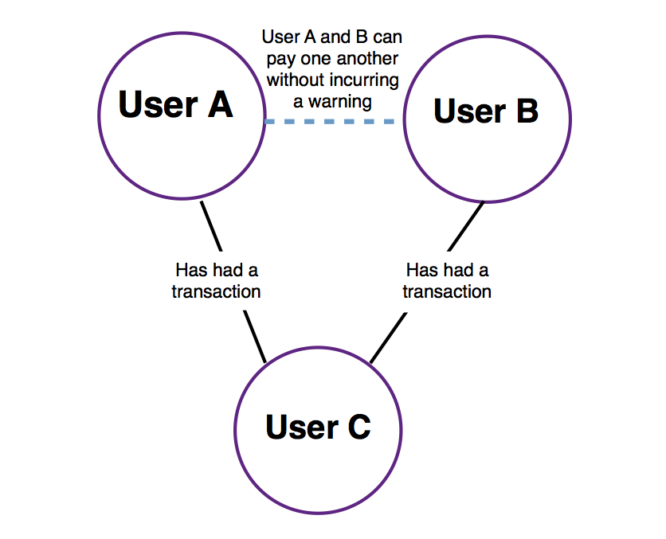

# Table of Contents

0. [How to use this code](README.md#how-to-use)
1. [My notes about Requirements](README.md#understanding-requirements)
2. [Basic UML of features](README.md#basic-uml)
5. [Details of implementation so far](README.md#details-of-my-own-implementation)
6. [Sketches](README.md#sketches)
7. [Personal Notes](README.md#personal-notes)

## How to use

@todo create a docker container to provide python 3.5 , pip, pandas, numexpr
@warning this is a Beta version. Dependencies/Requirements could change and wil be documented in this README file.

From root folder run as: $ ./run.sh ./paymo_input/batch_payment.csv ./paymo_input/stream_payment.csv ./paymo_output/output1.txt ./paymo_output/output2.txt ./paymo_output/output3.txt

#### Requirements

```
INSTALLED VERSIONS
------------------
commit: None
python: 3.5.1.final.0
python-bits: 64
OS: Darwin
OS-release: 15.6.0
machine: x86_64
processor: i386
byteorder: little
LC_ALL: None
LANG: None

pandas: 0.18.0
nose: 1.3.7
pip: 8.1.0
setuptools: 20.2.2
Cython: 0.23.4
numpy: 1.10.4
scipy: 0.17.0
statsmodels: 0.6.1
xarray: None
IPython: 4.0.1
sphinx: 1.3.1
patsy: 0.4.0
dateutil: 2.5.0
pytz: 2016.1
blosc: None
bottleneck: 1.0.0
tables: 3.2.2
numexpr: 2.4.4
matplotlib: 1.5.1
openpyxl: 2.2.6
xlrd: 0.9.4
xlwt: 1.0.0
xlsxwriter: 0.7.7
lxml: 3.4.4
bs4: 4.4.1
html5lib: None
httplib2: None
apiclient: None
sqlalchemy: 1.0.9
pymysql: None
psycopg2: None
jinja2: 2.8
boto: 2.38.0
```

#### Log

@see ./results.txt file for events while analyzing payments or/and preparing batch data.

## Understanding requirements
My Notes about requirements:

* Datasets: The Dataset is 'real'-Venmo. If dataset has interesting data use it for new features. batch_payment.csv (old transactions) - use to build the initial state of the user network. stream_payment.csv (stream transactions?) - use it to detect fraud or warn user. For now I'm only interested in
** id1: ID of user making the payment
** id2: ID of user receiving the payment

* Verify stream_payment.csv and batch_payment.csv have content. Using $cat file | more. Yes it has emojis, lol.

* Input: Not need to connect to an API. Datasets are inside paymo_input directory.

* Output: process each line from stream_payment.csv and for each payment output a line containing TRUSTED or UNVERIFIED.

* Assume that stream_payment.csv correspond to new payments - design program to handle text file with large number of payments

* Of course we want this to be fast -> It's critical that these features don't take too long to run.

* Well-document and scalable code

* Write Unit-tests especially because data is not clean

* I'll use Python

* I'll use a private repo meanwhile in Github (taking advantage of my private repos)

* My top directory must have paymo_input and paymo_output directories and a script called run.sh that compiles and runs the program that implements the features

* I’ll pass arguments to my own run.sh and run.sh will pass arguments to python script.

* My directory structure will be verified

###Feature 1


###Feature 2




###Feature 3


##Basic UML
Basic UML sequence diagrams created via PlantUML in order to make them version-able.
@see ./requirements/uml/*.puml

##Details of my own implementation

#### Clean (Sanitize) batch data 

* run.sh will take care of cleaning the firt batch of data (batch_payment.csv). I'll need only id1 and id2 so far.

#### Goal in my code

Till November 6th 2016 (Friday night and Saturday night - Sun early morning)

My implementation is based on Python 3. This solution requires pandas and numexpr libraries.

After trying implementing this with dictionaries and run out of memory I decided to use pandas dataframes and numexpr.

The goal is to create a matrix with the following structure: (@see sketch [3](./requirements/sketches/sketch3_20161106_032115.jpg) top-left corner).

            UserA   UserB  UserC
    UserA    1       0      0
    UserB    1       1      1
    UserC    1       0      0

Probably I will need a matrix for each generation (@see sketch [3](./requirements/sketches/sketch1_20161106_032036.jpg top-right corner).

* Tho, using dataframes will be fast to generate a similar matrix (see above example) when the program first load, the problem I'm finding so far is that in order to generate the matrix(ces) for a second, third, etc times it might take more time that expected. 
* **Warning:** If there's a new payment with new users I'll need to regenerate the matrices and might take a while. 
* @todo check graphs documentation
 

####  Sketches

While this does seems like a simple challenge at the begging I struggled and had to go over and over through my ideas, here some important sketches.


##Testing


#Personal notes

* *Notify when not a friend of a friend only? or when friend of a friend hasn’t make transactions?Re: Only if there were transactions before.*

* *While processing new payment the network could grow, right? yes*

* *Let’s say we don’t have the network on cache?*

* *I’ll document features in the README file. I’m using python 2.7 and pandas - maybe pandas is not needed.*

* *If I need libraries, environments or dependencies I have to document them in the README file*

* *UNIT test. For example: Date in payments greater or equal than current date always in new payments*

* *Data could be wrong formatter. E.G. Two commas for strings! - I’ll clean data even before Python reads it.*

* *Create a table per person ?*

* *Clean integers in IDs and put them into a error file*

* *Dependencies: python 3.5, “conda”, pip3.5, conda install numexpr -> dataframe.query*

* *What if while in a transaction the process is exited/terminated*

* *I was thinking on using dictionaries but decided to use dataframes very heavily: http://pandas.pydata.org/pandas-docs/stable/generated/pandas.read_csv.html , https://github.com/pandas-dev/pandas/issues/12008*

* *Maybe I need to clean id1 and id2 -> clean it from commas?*

* *There are Users with id 0 which I guess is fine*

## References

## Feature ideas
